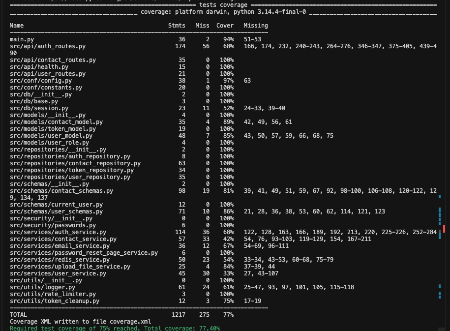

# Contacts API

A small REST API built with FastAPI for managing a personal contact book: user registration, authentication, full CRUD for contacts, search, and a list of upcoming birthdays. Each user only sees their own contacts.

## About the project

This is a learning-oriented Python web backend: async access to PostgreSQL, Alembic migrations, and Docker Compose. It also includes email verification, password reset, token storage in the database and Redis (user cache and rate limiting), a background job to clean up expired tokens, and admin avatar upload via Cloudinary.

Interactive API documentation is available in Swagger UI after the server starts.

## Main logic

- **Layers:** route modules under `src/api/*` handle HTTP and FastAPI dependencies; business logic lives in `src/services/*`; data access in `src/repositories/*`; SQLAlchemy models and Pydantic schemas stay separate from the transport layer.
- **Authentication:** JWT access and refresh tokens, password hashing with passlib/bcrypt, endpoints for signup, login, token refresh, email confirmation, and password reset flows using `fastapi-mail`.
- **Contacts:** after `Depends(get_current_user)`, all contact operations are scoped to the current user; the service delegates persistence to the repository against PostgreSQL.
- **Application infrastructure:** on startup, Redis is initialized and a background task runs `token_cleanup_loop`; on shutdown, the task is cancelled cleanly and Redis is closed. Request rate limiting uses `slowapi`.

Entry point: `main.py` (router wiring, CORS, rate limiter, lifecycle hooks).

## Tech Stack

- Python 3.12
- FastAPI
- SQLAlchemy (async)
- PostgreSQL
- Alembic
- Docker / Docker Compose
- Redis, python-jose, Cloudinary (where needed for full functionality)

## Run with Docker (recommended)

1. Copy environment file:
   - `cp .env.example .env`
2. Start services:
   - `docker compose up --build`
3. Open API:
   - `http://localhost:5001/docs`

## Run locally

1. Install dependencies:
   - `poetry install`
2. Copy environment file:
   - `cp .env.example .env`
3. Run migrations:
   - `poetry run alembic upgrade head`
4. Start app:
   - `poetry run python main.py`
5. Open API:
   - `http://127.0.0.1:8003/docs`

## Health check

- Endpoint: `GET /api/healthchecker`

## Tests and coverage

Test dependencies are in the `dev` group in `pyproject.toml` (`pytest`, `pytest-asyncio`, `pytest-cov`, `httpx`).

### Running tests

From the repository root (with the Poetry environment active):

```bash
poetry install --with dev
poetry run pytest
```

Useful options:

```bash
# verbose output
poetry run pytest -v

# single file or directory
poetry run pytest tests/unit/test_contact_service_unit.py
```

By default, `pytest` in `pyproject.toml` collects coverage for the `src` package and `main.py`, prints a terminal report including missing lines (`term-missing`), and enforces a **minimum coverage of 75%** (`--cov-fail-under=75`). If coverage is below that threshold, `pytest` exits with an error.

### Checking coverage

- After `poetry run pytest`, the end of the output shows a per-file coverage table and uncovered lines (`term-missing`).

Example terminal report (overall coverage above the 75% threshold):



HTML report (easy to open in a browser):

```bash
poetry run pytest --cov=src --cov=main --cov-report=html
```

Then open `htmlcov/index.html` in your browser.

To run tests **without** the coverage threshold (for example while iterating locally):

```bash
poetry run pytest --no-cov
```

Coverage `omit` paths (migrations and tests) and other options are configured under `[tool.pytest.ini_options]` and `[tool.coverage.*]` in `pyproject.toml`.
